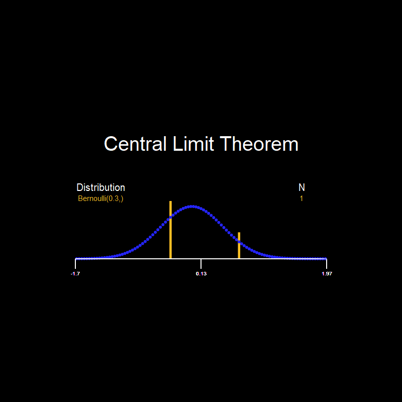
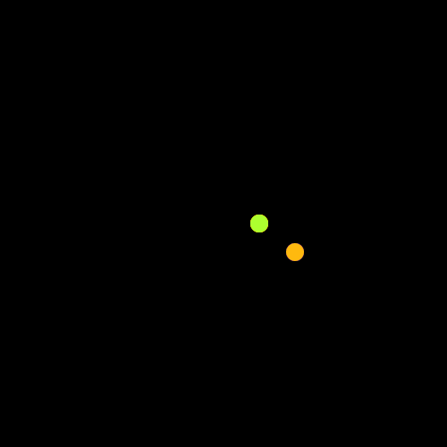

# JUtils.jl

## A Gallery of animations made with the awesome [Javis Library](https://github.com/Wikunia/Javis.jl)

| Point processes                                    |                                        |
|:-------------------------------------|:---------------------------------------|
| ||
| ||

|Some Statistics||
|-------------------------------------|-----------------------------|
|||

|The animations from a Javis [Tutorial](https://github.com/Wikunia/Javis.jl/blob/master/docs/src/tutorials/tutorial_8.md) Check it out, with all the others!!||
|------------------------|------------------|
|||
|||
## Presentation
